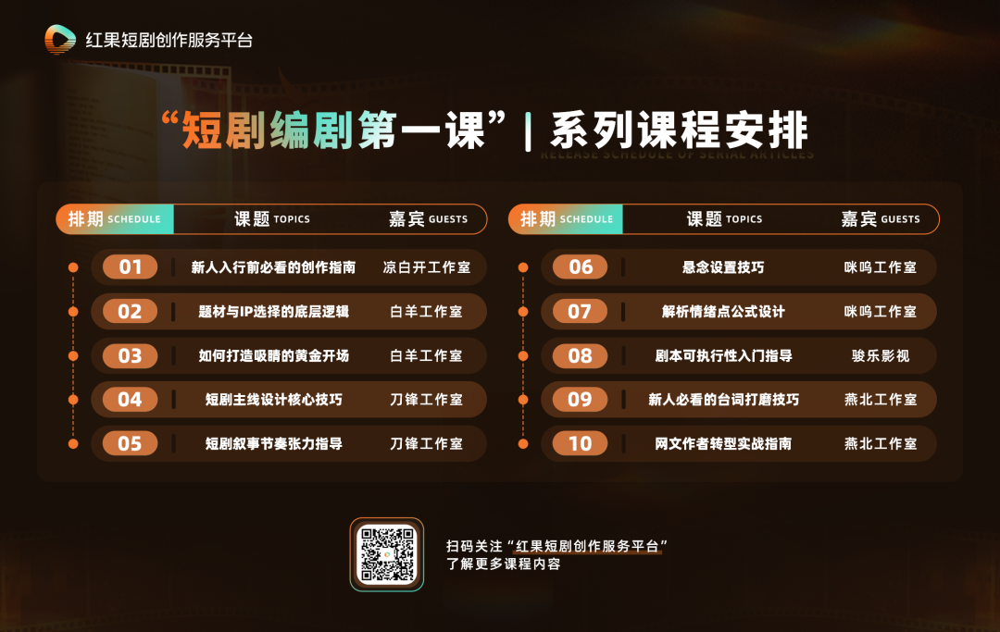

# 短剧编剧第一课｜05期：揭秘短剧节奏的设计密码

- 公众号：红果短剧创作服务平台
- 发布时间：2025-12-31 11:30:00
- 原文链接：https://mp.weixin.qq.com/s/l_XKgSAaXseko8zJfjvtxA

## 导语

微短剧正以其独特的叙事魅力，深入当代观众的生活日常。当一段故事在方寸屏幕间展开，是什么让观众在关键时刻屏住呼吸、心跳加速，迫切想知道“接下来会发生什么”？又是什么让他们愿意静下心来，沉浸于细腻的情感之中，舍不得划走？

这背后的关键，不仅在于剧情本身，更在于叙事中那一收一放、一张一弛的节奏。它像一双无形的手，牵引着观众的情绪，影响着他们是“忍不住追下去”，还是“随时想离开”。

红果短剧创作服务平台推出「短剧编剧第一课」系列内容，本期聚焦“节奏设计”这一核心议题，特邀曾打造多部分账破千万爆款短剧、红果短剧创作服务平台入驻剧本工作室——刀锋工作室的负责人周怀宇，为新人编剧带来短剧叙事节奏的深度指导。

刀锋工作室（珺璟文化）是一家专注于红果平台短剧内容创作的机构，汇聚了800余位优秀编剧，始终致力于打造高品质、高口碑的精品短剧。代表作包括《替君语落阶》《白月光悖论》《七零辣妻治家手册》《哄她梦甜》《重回18岁，竹马酿青梅》《被读心后成了万人迷》等多部爆款短剧。本节课中，周怀宇将帮助新人深度拆解——如何打造张弛有度、层层递进的故事节奏。

以下为访谈精华，全文约6000字，阅读预计需要15～20分钟。

“创作者，是观众的情绪管理大师，你需要知道观众什么时候该紧张、什么时候该松一口气，什么时候该哭、什么时候该笑。掌控好短剧的节奏，才能让故事既好看，又留得住人。”

———周怀宇

谈起短剧节奏，许多人第一反应往往是“要快”。但在周怀宇看来，这种理解流于表面。“真正的节奏设计，是一套对故事推进与观众情绪起伏的精心布局。”

节奏之所以至关重要，首先在于短剧的观看场景多为碎片化时间，观众注意力有限。因此，前三集若能有效激发兴趣、传递情绪、埋下悬念，往往能自然引导观众继续追看后续内容。

往深了说，节奏的本质是一种对观众情绪的管理。无论是复仇的快意、甜宠的甜蜜、逆袭的高燃还是悬疑的紧张……这些情绪体验都需要通过节奏来组织、释放和延续。好的节奏让观众在“紧张—放松—期待”的循环中获得持续满足，越看越上头，一集接一集根本停不下来。

反之，若节奏拖沓、剧情平淡、信息冗余，观众很快会感到无聊，甚至觉得浪费时间。尤其在红果这类免费平台，用户无需付费，稍觉无趣便会直接划走。因此，对短剧而言，节奏不只是叙事技巧，更是决定作品生死的关键命脉。

一部标准的80至100集短剧，其整体节奏需要有清晰的阶段性规划。周怀宇将这一长线叙事节奏划分为“窗口期—发展期—收束期”三个关键阶段，每个阶段承担不同的叙事功能，共同支撑起整部剧的情绪曲线。

## 01 第1-10集：黄金窗口期

周怀宇认为，前十集是决定短剧能否留住观众的“黄金窗口期”。在这个阶段，编剧需要迅速确立故事主线，并亮出最具吸引力的核心看点，让观众在短时间内理解“这是个什么故事”，并产生“后来呢？”的强烈好奇。

这种吸引力可以来自多个方向：比如主角迅速展开反击带来的畅快感；或设置一个引人入胜的悬念，激发观众的好奇感；又或是通过不公遭遇引发共情，让观众等待后续“反转”的期待感。无论采用哪种方式，目标都是在有限集数内建立起足够强的观看动机。

周怀宇以《七零辣妻治家手册》为例，该剧开场即安排女主穿越回七十年代，并通过闪回快速交代她在家庭中所受的不公对待；随后她获得“金手指”（指主角拥有的特殊优势，如系统、异能或预知能力等），并迅速展开首次反击。紧接着，女主与核心反派产生正面冲突，节奏紧凑。在主线冲突之间，穿插如“不再委屈求全”“与男主温馨互动”等日常片段，既调节叙事节奏，也进一步塑造人设。到第9–10集，剧情逐步铺垫高潮：长辈带人上门兴师问罪，而男主恰好不在，女主孤身应对，紧张感与悬念同步拉满，为后续发展埋下有力伏笔。

## 02 第11-30集：稳固发展期

当观众被初步吸引后，接下来的20集任务从“抓住人”转向“留住人”。此时故事需要进一步展开，主线应有实质性推进，避免陷入重复或停滞。

例如，在复仇类剧情中，主角的计划不应只停留在口头，而要逐步落地并取得成果；甜宠剧中，男女主角的关系也需从试探走向明确进展。同时，可适度引入支线情节，丰富世界观，增强真实感，为后续高潮积蓄势能。

以《七零辣妻治家手册》为例：第10集的冲突直接延续，女主与反派展开激烈对峙，关键时刻男主现身维护，推动剧情实现第一个重要目标——分家。随后安排一段温馨日常作为缓冲，既缓解高强度冲突带来的疲劳感，也深化角色关系，体现“张弛有度”的节奏设计。

## 03 第31-80集：高潮收束期

剧集进入后半程，剧情逐渐走向高潮密集区。前期埋下的伏笔和悬念开始逐一揭晓，同时通过多轮反转与对抗，维持观众的观看兴趣。

这一阶段的重点在于保持节奏起伏：既有激烈的冲突，也有情感升温或生活化的调剂。主角在解决新问题的过程中实现个人成长与目标达成。最终，前期积累的情绪，无论是愤怒、期待还是喜爱，都将在这一阶段集中释放，形成全剧的情感高点。

在《七零辣妻治家手册》中，分家后的女主努力经营新生活，而反派则不断制造麻烦，如指使他人骚扰、散布谣言等。女主凭借智慧一次次化解危机，与反派持续博弈。与此同时，她与男主的感情线也在共渡难关中稳步升温。整段剧情节奏变化有序，最终导向事业与感情双线圆满。

周怀宇补充道：“过去做付费短剧时，行业常说第10集是‘付费坎’——要把观众的情绪调动到愿意付费的程度。如今在免费平台，这个逻辑转变为‘留存坎’：观众的情绪需要被更快地拉升，并在整个观看过程中持续维持，因为观众随时可能划走。”

如果说全剧节奏是规划一张宏大地图，那么单集节奏就是更具体的精密路线——它需要高度浓缩，在分秒之间精准传递冲突、情绪或转折。一集只有1到3分钟，每一秒都无比珍贵。周怀宇以1分30秒的单集为例：

## 01 前30秒：制造理由，让人停下

这30秒的任务就是让滑动的手指停下来。例如短剧在《七零辣妻治家手册》中，第一集开头：女主醒来摸到头上的伤，看到七十年代的日历，立刻意识到自己穿越了——背景、困境、动机，30秒内全部交代清楚，同时在短时间内吸引住观众。

## 02 中间1分钟：推进故事，注入干货

这是一集的核心段落，不能光是人物闲聊或者空泛的抒情，需要包含推动主线、揭示人物关系、埋下新伏笔的“干货”。节奏要紧凑，每一句台词、每一个动作，最好都能对情节发展有帮助。如果这一分钟“水分”太大，观众立马就能感觉到，流失也就在一瞬间。

## 03 最后30秒：留下伏笔，勾住下一集

“最后30秒的任务，是确保观众心甘情愿地点击下一集。”这里需要设计一个强有力的悬念、一个未完成的动作、一句意味深长的台词或一个突如其来的反转，将观众的期待值直接“吊”到下一集的开头。

“‘前30秒定生死’是行业里公认的法则。”周怀宇打了个比方，“就像推销员，你只有30秒向客户介绍产品，留不住他，生意也就黄了。”

周怀宇认为，很多人对短剧节奏有误解，要么觉得必须一味求“快”，要么完全否定“慢”，其实都不对。节奏并非一刀切，而应因题材而异。

## 01 复仇/逆袭题材：快、狠、准

这类剧的核心是“强情绪”。开篇需要用最直接、最强烈的方式迅速建立“仇恨”，如《卿色无双》开篇女主被害死、男主殉情，开篇让观众的愤怒值瞬间拉满。节奏必须紧凑，如海浪般一波未平一波又起。

周怀宇强调：“仇恨得像一根针，尖锐清晰。观众必须立刻明白——她恨谁？为什么恨？怎么报仇？”整体遵循“三五集一个小高潮，十集一个大高潮”的结构，让解气的畅快感持续输出。

## 02 甜宠剧：张弛有度，情感细腻

甜宠剧的节奏可以适度放缓，重心放在塑造人物魅力和培养CP感上。它需要用大量温馨、甜蜜的互动细节来积累情感，让观众全程“姨母笑”。

但“慢”不等于“平”，需要设计“误会—吃醋—和解—升温”的情感起伏线来制造波澜。有时，一个巧妙的设计就能拉快节奏，如《哄她梦甜》中，女主穿越后找人假结婚，却阴差阳错找到了最想躲开的男主，戏剧性和节奏感瞬间提升。

## 03 慢节奏精品剧：以质取胜，门槛更高

像《盛夏芬德拉》《难哄，许枝俏谈个恋爱吧》这类剧，节奏明显偏慢，但凭借精良的制作、深入细腻的情感刻画或极致新颖的人设获得了成功。如《盛夏芬德拉》中男女主细腻的情感拉扯让观众磕不停，《难哄，许枝俏谈个恋爱吧》中“恐男症”妹宝与“厌女症”太子爷的设定给观众带来新鲜感。

周怀宇提醒新人：“慢节奏不等于拖沓，但要驾驭好它，往往需要更强的笔力、更成熟的节奏把控能力，甚至更高的制作资源支持。如果缺乏这些支撑，单纯放慢节奏，很容易让观众感到冗长、失去耐心。”

想把节奏做好，编剧需要在几个方面下功夫。周怀宇总结了以下要素：

## 01 情节编排：冲突的艺术

“开篇最好就能用一个有趣、新颖的冲突抓住人。”周怀宇表示。冲突设计要有层次：一个核心冲突要像推倒多米诺骨牌一样，能够引发一系列连锁反应，持续推动主线。

例如在短剧《卿色无双》中，前十五集都紧密围绕“接风宴”这一核心事件展开，呈现出一个结构完整的起承转合。开篇通过“跳水事件”展现女主对女二的反击；中段以“女主更衣与男主暧昧互动”推进情感；高潮落在“女主阻止女二救援男二却自身遇险，男主不惜动用保命丹药相救”；结尾则聚焦于“男女主各自展开报复，令女二自食其果”。通过情节编排让冲突层层递进、持续释放情绪张力，并在结局干净收束，整体观感流畅、情节饱满。

## 02 台词设计：字字千斤，拒绝水词

短剧台词的要诀是：字少，精准，符合人设。最忌讳大段旁白或对话，动辄五六行的台词会严重拖慢节奏，演员念着吃力，观众听着也累。

要追求那种画龙点睛的“金句”。在剧情的高光时刻，一两句精准有力的话，能极大地增强感染力，例如在短剧《卿色无双》中，女主的台词：“我从来不是什么好人，若有人敢伤我，我必将还回去，而且是双倍！”用一句话就清晰交代了女主的人设——有仇必报，双倍奉还。同时带出全剧核心思想，就是来复仇的！

反之，堆砌辞藻、长篇解释的台词，可能成为节奏的“杀手”。

## 03 人物关系：节奏变化的催化剂

人物关系的动态变化，是扭转剧情、调节节奏最有效的工具之一。关系变化本身就能产生看点，如甜宠剧中男女主从暧昧到确认关系的每一步都牵动人心。

关系突变则能制造“强力反转”，例如《难哄，许枝俏谈个恋爱吧》中，男女主从第一集慢节奏的陌生人见面，到第二集迅速转变为“暧昧追求”关系，剧情节奏也随之明显加快。后续女主与家庭产生冲突，男主顺理成章介入帮助，主线剧情就此快速展开。有计划地通过这种“意料之外，情理之中”的人物关系变化来引导观众情绪，能让故事避免平淡。

## 04 情感控制：情绪引导节奏

观众的情绪状态直接决定了他们对节奏的感知。以《卿色无双》为例，当女主重生后面对仇人时，情绪是愤怒与急迫，节奏自然加快，冲突一触即发；而当她面对曾为自己殉情的男主时，情绪转变为温情与试探，节奏便相应放缓，充满撩拨与暧昧。

“将不同情绪的场景穿插安排，能自然形成张弛有度的节奏曲线。”周怀宇总结，“此外，要学会有计划地引导观众情绪，核心在于多设置‘意料之外，情理之中’的反转，让故事始终有情绪（喜怒哀悲），避免平淡，使观众能深度共情。”

对于想提升节奏感的新人编剧，周怀宇给了两条最实在的训练方法：

## 01 核心训练：学会“做减法”

“写完剧本初稿后，一定要回过头再看一遍，把所有影响主线推进的桥段、多余的人物、累赘的设定和台词，狠下心删掉。”这是提升节奏感最快、最有效的方法。

周怀宇表示，新人常有的毛病是觉得自己写的每个点子都好，都舍不得删，但往往就是这些“舍不得”，让整个剧的节奏变得拖沓。

## 02 高效学习法：针对性“拉片”

多看看爆款短剧是对的，但得有方法地看。周怀宇建议重点看这几个方面：开头怎么切入？前30秒是怎么介绍人物、建立情绪、留下悬念的？冲突怎么发展？矛盾是怎么一层层升级、不断推进的？钩子怎么设计？每一集结尾是怎么卡住，让你忍不住点下一集的？

他还特别补充说：“建议优先看非顶流演员主演的爆款，更能看清剧本本身的节奏功力。”

最后，周怀宇为新人提供了一份节奏设置“避坑指南”：

## 01 警惕无效的“嘴炮”拖沓

有些早期短剧作者，容易习惯将一个情绪点用大量对话拉扯十几集。周怀宇表示，要坚决拒绝无效“嘴炮”，每一集都要有实质性的故事进展。

## 02 避免“节奏失衡”

有些新人编剧简单将单集节奏划分为“冲突-发展-交锋-结尾”。任何一环进展太快（如冲突刚起就草草结束）或太慢（如冲突提出后迟迟不推进，转而描写大量无关支线），都会导致失衡，让观众感到突兀或无聊。

## 03 别被“慢节奏爆款”误导

看到节奏慢的剧成功了，要去分析它成功的根本原因——是制作精良、情感深刻还是人设出彩。而不是盲目地去模仿它的“慢”。新人通常没有顶级的制作团队和明星演员来加分，在节奏上出错，成本会很高。

## 04 避免桥段窠臼

“故事不能总是老一套，同一种类型的桥段千万别反复用。”周怀宇举例说，“比如，女主角这集不小心打坏一个古董花瓶，下集又失手弄坏一件名贵首饰，本质都是‘损坏贵重物品’，这就是重复，观众会腻的。”真正的变化应该是类型的转换，比如从吵架升级为正面冲突，或者从家庭内部的争斗转向外面的挑战。

## 结语

从宏观的百集整体节奏，到微观的单集卡点设计；从不同题材对节奏的差异化运用，到对情节推进、台词密度与人物关系张力的精细把控——周怀宇为新人编剧系统地构建了短剧的节奏方法论。

真正的高手，不仅懂得如何“快”，更知道何时该“慢”；不仅会制造冲突，更擅长在张弛之间编织情感的网，让观众心甘情愿地一集接一集追下去。

这种对节奏的精准拿捏，本质上是对观众情绪的深度理解与引导。正如周怀宇所说：“创作者，是观众的情绪管理大师。”而节奏，正是你手中的指挥棒。

## 下期预告

> Next in Series

下一期，我们将对话咪呜工作室，深入揭秘短剧创作的核心技巧——“悬念设置”：如何通过一个个钩子，牢牢锁定观众的注意力与好奇心？敬请期待！

「短剧编剧第一课」系列课程计划10期访谈，将依次从新人入行指南、题材/IP选择、黄金开场、剧本主线结构、节奏与卡点设置、悬念设置、情绪爆点设计、台词打磨、网文作者转型和剧本落地性等10个方向展开科普与讲述。

更多课程内容，将收录于“短剧编剧第一课”合集

欢迎关注↓

微信扫一扫  
关注该公众号

微信扫一扫可打开此内容，  
使用完整服务
