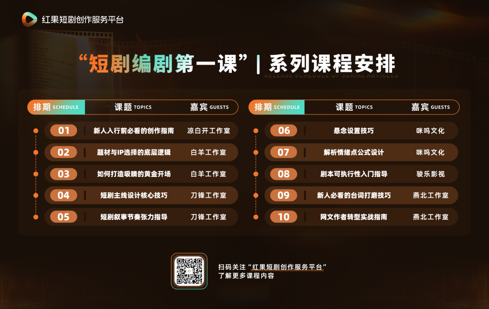

# 短剧编剧第一课｜06期：期待、悬念、钩子设置的底层逻辑

- 公众号：红果短剧创作服务平台
- 发布时间：2026-01-06 11:33:05
- 原文链接：https://mp.weixin.qq.com/s/a9Euw2Rs6hi2nfK-6iWilg

## 导语

微短剧正以惊人的渗透力融入我们的日常生活——通勤路上、午休间隙、睡前片刻，它渐渐成为人们的情绪出口与娱乐刚需。

从第一秒抓住眼球，到最后一秒钩住好奇，这背后是一场精心设计的心理牵引。每一帧画面、每一句台词、每一次转折，都在无声中累积期待、铺设悬念、埋下伏笔——这些看不见的支点，共同构成那个让观众欲罢不能、持续沉浸的故事引擎。

红果短剧创作服务平台推出「短剧编剧第一课」系列内容，本期聚焦“期待、悬念、钩子设置”这一核心议题，特邀曾打造多部分账破千万爆款短剧、红果短剧创作服务平台入驻剧本工作室——咪呜文化的编剧小西，为新人编剧解析期待、悬念与钩子设计的核心技巧。

咪呜文化是一家在短剧领域表现突出的创作团队，以扎实的内容功底和稳定的创作基因打造了多部爆款短剧。代表作包括《领证当天，捡了个老公回家》《我有八个姐姐，但是她们都是弟控》《反方向的钟》《重生后我把老婆女儿宠上天》。本节课中，小西将帮助新人深度拆解“期待、悬念与钩子”的底层逻辑与实操技巧。

以下为访谈精华，全文约8000字，阅读预计需要15～20分钟。

“短剧是情绪的艺术，而情绪需经过设计。期待是方向，悬念是路径，钩子是动力——三者环环相扣，才能让观众从‘看一眼’到‘追到底’。”

———小西

小西表示，短剧是情绪的艺术。人的情绪千变万化，而创作者的任务，就是通过故事引导观众的情绪走向——让他们紧张、愤怒、心疼、期待、惊喜……最终形成情感依赖。

小西指出，很多新人刚接触短剧创作时，容易陷入这样的误区：一味追求“节奏快、反转多、台词狠”。但这些只是表层技巧，真正留住观众的是情绪的牵引力。为此，小西将创作中的情绪引导提炼为三个核心要素：期待、悬念与钩子。

尽管短剧单集只有1–3分钟，但整部短剧往往长达80–100集。若缺乏清晰的情绪节奏设计，观众可能在中途弃剧。小西打了个比方：如果把一部剧本比作一棵树，期待就是树干——它支撑起整个故事的核心方向，是所有情节得以生长的依托；悬念是枝叶——不断延展剧情张力，激发观众继续观看的兴趣；而钩子则是根茎——在每集结尾埋下伏笔或制造冲击，为下一集输送“营养”，推动观众继续追看。

没有期待，观众不知道故事要讲什么；没有悬念，剧情平铺直叙，令人乏味；没有钩子，每集结尾缺乏“推力”，观众看完一集便划走。

除此之外，小西认为三者有明确的先后逻辑。新手常犯的错误，是一上来就琢磨“怎么写出精彩的结尾钩子”，却忽略了整部剧最根本的问题：如果无法在开头给出一个坚实、诱人的核心期待，那么后续所有试图挽留观众的技巧，就会成为“无本之木”。

期待，是观众打开第一集的理由，也是追到最后一集的动力，小西将期待分为两类：大期待和小期待。前者是整部剧的“戏眼”，后者则是推动剧情一步步向前的“台阶”。

## 01 大期待：

主角的终极目标，是整部剧的“戏眼”

什么是大期待？简单说，就是主角整部剧要完成的终极目标。比如：你的主角最终要完成什么？是打脸反派？是找回失散的女儿？是从废柴变成战神？不管是什么，最晚第二集，必须直白地展现出来。不要藏，不要绕，不要让观众猜。

比如在短剧《重生后我把老婆女儿宠上天》中，第一集就明确点出故事大期待：主角重生回来，这辈子要弥补上辈子对妻女的亏欠。观众立刻明白——“哦，这是一个赎罪宠妻的故事，我想看他是怎么做到的。”

## 02 小期待：

把大目标拆成阶段目标，像打游戏做任务

有了大期待，接下来就要拆解出小期待——也就是主角在达成终极目标前，需要完成的一个个阶段性任务。

比如终极目标是“家族复仇”，那小期待可以是：第一阶段（1–20集）：策反哥哥，拿到家族账本；第二阶段（21–40集）：揭露反派当年的阴谋；第三阶段（41–60集）：联合盟友，夺回家产；最终阶段（61–80集）：当众揭穿反派，完成复仇。

“每个阶段都有一个小目标，每个小目标都是一个小期待。这就跟打游戏一样，”小西比喻，“终极任务是打败魔王，但你得先打小怪、拿装备、升级技能。每完成一个小任务，观众就知道离胜利又近了一步。”

有了期待，下一步就是制造悬念——让观众好奇“他到底能不能成功”。小西表示，短剧的“悬念”和悬疑剧的“悬念”不同。它的核心更多在于：“已知目标，但不知过程”——主角如何克服万难，去实现那个阶段性的期待？

对此，小西表示通过“信息差”可以制造悬念。所谓信息差，就是剧中人物（主角、配角）和剧外观众，对于同一件事的“知情程度”不同。这种“你知道，我不知道”或者“我知道，你不知道”的错位，天然就会产生好奇和张力。

小西总结了一套悬念的“三元理论”，涉及三个角色：观众、主角、配角（通常是反派或关键人物）。通过对三者之间“信息差”的排列组合，可以形成多种悬念模型，其中以下四种最为常见：

## 01 主角知道，观众和配角不知道

典型例子就是《柯南》。凶手已经锁定，作案手法已经破解（主角知道），但观众和剧中的其他角色还蒙在鼓里。悬念在于：“主角什么时候揭晓？真相会有多震撼？”这种模式营造的是解谜的悬念感。

## 02 配角和观众知道，主角不知道

这类信息差多出现在身份觉醒短剧中。比如，观众和配角都知道主角的亲生父母是顶级富豪，正在到处找他。只有主角自己还以为自己是孤儿，在底层苦苦挣扎。悬念在于：“主角什么时候才知道？知道后会是什么反应？”这种模式利用的是观众“先知先觉”的优越感和对主角反应的期待。

## 03 观众知道，主角和配角不知道

这类信息差在穿越文、年代文中常见。主角带着现代记忆和知识回到过去，但那个时代的人对此一无所知。观众看着主角用未来的常识“降维打击”古人，悬念不在于“能不能成”，而在于“古人会被震惊成什么样？”这种模式带来的情绪点更加直接。

但需注意的是，这种优势应建立在合理认知落差之上。若动辄用九九乘法表等基础常识当作“神技”来碾压古人，不仅削弱故事可信度，也容易让观众感到被刻意降智。

## 04 主角和观众知道，配角不知道

这类信息差也是短剧最经典、最常用的模式。比如主角是隐藏大佬（战神、神医、首富），观众通过开篇的暗示或旁白也知道了。唯独剧中的配角（恶毒反派、嚣张情敌、势利眼同事）不知道，还在疯狂嘲讽。悬念在此拉满：“这个配角还能作死到什么程度？”“主角到底第几集才亮身份？”“亮身份时他们的表情会有多精彩？”这种模式将“期待打脸”的情绪最大化。

小西表示，一部短剧不仅包含多种信息差，仅仅是“知道/不知道”的简单切换，就能衍生出无穷的戏剧张力。作为编剧，在设计每一个阶段性目标（小期待）时，可以有意识地运用不同的“信息差”组合，来为这段路程制造悬念。

当你的故事全程有了清晰的期待和充满张力的悬念，最后一步，就是让观众像上瘾一样一集接一集看下去，不会在半路“下车”。这就要靠每一集结尾的“钩子”了。

## 01 钩子的设置：把高潮拆成两半

那么，钩子具体该怎么做？小西给出了一个黄金法则：把高潮“切开”，一半留到下一集。

很多新人编剧容易习惯在一集之内，完成一个完整的“起承转合”闭环，例如剧情已经在这里完结，观众看得心满意足，然后……就没有然后了。

小西建议让一集结束在“高潮”即将爆发的前一秒。这样做的原理很简单：“人是会为冲动付费的，但不会为已经得到的东西付费。”小西比喻道，“短剧也是如此。你要让观众始终处在‘即将得到但还没得到’的状态，他们才会有看下去的兴趣。”

## 02 钩子的类型：有张力的台词+冲击力的画面

钩子的核心在于制造“未完成感”——让观众心里悬着一口气，忍不住点开下一集。根据小西的实战经验，有效的钩子主要通过两类方式实现：具有张力的台词和富有冲击力的画面。

台词要有张力，不必冗长，但要有冲突感和指向性——比如一句未说完的质问、一个突然抛出的身份暗示（你真以为我不知道你是谁？），或是一句带着情绪的目标宣言（明天股东大会，我会让你一无所有），都能在结尾制造强烈的“未完成感”，让观众迫切想知道下文。同时，台词要服务于剧情，而不是为了刺激而硬加。

画面则讲究节奏与留白。可以在情感即将爆发的瞬间切掉镜头——比如两人对视却未开口、手伸出去却未触碰；也可以在动作关键时刻中断，如门被推开一半、信封刚拆开一角。甚至一个意外出现的身影、监控画面里一闪而过的熟悉面孔，都能成为视觉钩子。这些手法不需要大场面或复杂制作，核心在于精准卡点：让观众看到“快要揭晓”的那一刻，却偏偏停住，从而自然产生“去下一集看看”的冲动。

理论讲完了，小西以咪呜文化创作的爆款短剧《我有八个姐姐，但是她们都是弟控》作为示例，演示如何串联期待、悬念和钩子。该剧讲述了流落凡间的小乞丐意外觉醒身世，被八位姐姐强势守护、共渡重重成长难关的故事，目前该剧在红果短剧App累计观看量已突破15亿。

以下为咪呜文化剧本示例，

仅供新人参考：

第一集

1-1

地点：日，外，山谷

人物：王小柯师父、王小柯

王小柯师父：（叹气）唉，眼瞅着就要飞升，却至今还没找到能继承衣钵的徒弟，（抬头望天）老天爷，赐给我一个徒……咦，那是什么？

▲王小柯自空中落下

▲王小柯师父甩出拂尘，拂尘变长，将王小柯卷了过来，打量

王小柯师父：嘶！好一个钟灵毓秀，适合修仙的苗子，老天爷待我不薄啊，老夫一定悉心教导！

1-2

地点：日，外，山谷

人物：王小柯师父、王小柯（五岁）

【字幕：五年后】

▲王小柯盘坐在蒲团上打坐

师父vo：柯儿！

▲王小柯睁眼，眼中神光闪耀，看向师父

王小柯：师父！

▲师父位于高空云团之上

师父：柯儿，你天赋异禀，年仅五岁就能熟练掌握书法、下棋、中医、乐理等修仙百艺，且修仙入门，有了自保之力，该下山了。

王小柯：师父，你不要柯儿了吗？

师父：不是为师不要你，而是为师即将飞升仙界，你呢，也该寻找家人去了。

▲师父挥舞拂尘，王小柯消失

1-3

地点：日，外，街道

人物：王小柯、群演若干

▲人行道，王小柯忽然出现

林晓晓vo：（大喊）小心！

▲王小柯扭头

▲一辆轿车行驶而来

△案例解析：在第一集中，师父告知王小柯该下山寻亲，用台词建立大期待：寻找家人。结尾时，王小柯突然出现在车流中，面临车祸危险，这是一个典型的视觉钩子，制造紧张感和突发危机。

第二集

2-1

地点：日，外，街道

人物：王小柯，林晓晓、叶兴、群演若干

▲汽车猛然刹住

▲王小柯一屁股坐在地上

▲林晓晓冲过去扶起王小柯，仔细检查

林晓晓：这位小朋友，你没事吧？

王小柯：（憨笑）善良姐姐，我没事。

▲胖子司机下车

胖子：小乞丐，没长眼睛吗？想碰瓷是吧？！

▲林晓晓指着红绿灯

【特写：红灯】

林晓晓：（气呼呼）你才没长眼睛呢，这是红灯！红灯停你知道吧！

司机：红灯怎么了，害老子差点出事。

▲司机抬脚就朝王小柯踹去

▲叶兴拦住，被踹翻在地

林晓晓：叶兴！

▲林晓晓扶起叶兴

林晓晓：（怒冲冲）明明是你的不对，你怎么还打人呢？！

▲王小柯握紧拳头

王小柯：（严肃）坏人！给善良哥哥和好心姐姐道歉，不然柯柯要生气了！柯柯生气，后果很严重！

司机：生气？后果严重？（嗤笑）噗，你生气个给我看看？你严重个给我看看？

2-2

地点：日，内，车内

人物：王思琪、群演

▲王思琪看着手机上的一块玉石【王小柯戴的那个】

王思琪：（叹气，os）五年了，小弟，你究竟在哪里？

▲忽然车辆停住

▲王思琪抬头，皱眉

王思琪：小莲，怎么回事？

小莲：总裁，前面有人打着我们王氏集团的名义，欺负一名小乞丐。

王思琪：哼！我倒要看看是谁有这么大的胆子！

△案例解析：建立信息差：观众已知王思琪是姐姐，但主角和其他角色未知。这种信息不对称为后续剧情制造了悬念。

第三集

3-1

地点：日，外，街道

人物：王小柯，王思琪、群演若干

▲王思琪朝众人走去

群演1：嘶！好漂亮的女人！

群演2：快看那辆车的车牌，豹子号啊，那可是王氏集团总裁的座驾！

群演3：难道说，她就是王氏集团的总裁王思琪？！

▲王思琪来到胖子司机面前

王思琪：你是王氏集团的人？

司机：（卑躬屈膝）是是是，见过总裁。

王思琪：从今天开始，你不是了。小莲，（冷眼瞥向司机）我们王氏集团，不需要这样的社会败类，你明白吗？

小莲：明白，总裁。

▲司机瘫坐在地

司机：（哭喊，哀求）总裁大人，我知错了，求求你饶过我吧。

小莲：滚。

▲保镖往前一步

▲胖子怂了，起身离开，忽然回头

胖子：（恶狠狠）小乞丐，你等着！老子不会放过你的！

▲胖子离开

▲王思琪来到王小柯面前，上下打量

王思琪：（os）好可怜的小孩子，看起来才五六岁，要是小弟不失踪，现在应该和他一样大了吧。

▲王思琪从包里拿出两百块钱，蹲下，将钱放到王小柯手里

王思琪：（温柔）小朋友，拿着这些钱，去买点好吃的吧。

王小柯：（微笑）谢谢漂亮姐姐。

▲王思琪起身

王思琪：（叹气，os）小弟，你到底在哪里啊？

▲王思琪离开

▲林晓晓和叶兴来到王小柯面前

林晓晓：小柯，你没事吧？

王小柯：（笑）善良姐姐，小柯没事！

林晓晓：（松了口气）小柯，你家人呢？

王小柯：（失落）爷爷不久前去世了，师父也暂时离开了。

林晓晓：小柯，要不你跟着姐姐回家怎么样，姐姐养你！

王小柯：（摇头）对不起善良姐姐，小柯不能跟你回家，小柯还要找家人呢，他们肯定也在着急找小柯！

▲车内

▲王思琪再次看向玉佩照片

王思琪：（低喃）小弟，你到底在哪里？

▲王思琪抬头，看向王小柯

王思琪：（愣住）等等，莫非他就是小弟？！

△案例解析：再次利用信息差制造悬念：姐姐开始怀疑主角身份，但尚未确认。观众因知晓更多信息而产生强烈期待，关注“何时相认”与“如何相认”。

第四集

4-1

地点：日，外，街道

人物：王小柯，王思琪、群演若干

▲王思琪摇头

王思琪：（os）看来最近是想小弟想疯了，怎么可能随便遇到的一个小孩子正好是小弟呢？

▲车辆启动，和王小柯错身而过

▲王小柯和王思琪视线交接

王小柯：（微笑）漂亮姐姐，再见！

王思琪：（微笑）小弟弟，再见。

▲车辆远去

▲王小柯看向男生女生

王小柯：善良哥哥和姐姐，小柯要去寻找家人了，再见喽。

▲王小柯蹦蹦跳跳离开

4-2

地点：日，外，街道

人物：王小柯、群演若干

▲一个卖盒饭的摊位前，王小柯盯着炒饭舔嘴唇

王小柯：奶奶，我要一份米粉炒肉肉，还要一杯阔乐。

▲王小柯踮起脚，将钱递给老奶奶

▲老奶奶收下钱，将吃的递给王小柯

老奶奶：拿好了，慢慢吃，不够再来找奶奶。

▲王小柯接过

王小柯：谢谢奶奶。

▲王小柯提着食物，高兴走到一边

▲忽然，愣住

▲透过玻璃，看到餐厅里面一家三口其乐融融吃饭

▲父亲给小女孩喂饭

▲母亲宠溺的捏着她的小脸蛋，把奶茶放到身边

王小柯：（失落）有家人真好，等柯柯吃完饭就去找家人。

▲王小柯离开

【特写：脖子上玉佩露了出来】

▲不远处，一胖女人看到玉佩，眼前一亮，朝王小柯撞去

胖女人：哎呦！

▲王小柯被撞到，食物和可乐散落一地

胖女人：哪来的小乞丐，站这里干嘛，快滚一边去，恶心！

▲王小柯捡起地上散落的食物，飞快离开

▲王小柯来到公园，坐在阴暗角落，缩成一团，身体止不住的颤抖

王小柯：（哭泣）呜呜呜，柯柯是没人要的孩子，别人都有爸爸妈妈，可我的爸爸妈妈不要我，呜呜呜。

▲王小柯抬起头

王小柯：（坚定）柯柯一定要找到家人！

▲王小柯伸手摸向脖子上的玉佩

王小柯：（诧异）咦？宝贝玉佩呢？

第五集略

第六集

6-1

地点：日，内，办公室

人物：王思琪、小莲

王思琪：（激动）小莲，真找到小柯的下落了？你可千万不要骗我！

小莲：董事长，您请看。

▲小莲递上玉佩

王思琪：这是？

▲王思琪接过，仔细观察

王思琪：（手微微颤抖）是小柯的玉佩，没错，就是小柯的！（猛然抬头）这玉佩，是在哪里发现的？

小莲：在雁北区，我们已经派人调取了附近的监控，董事长您请看。

▲小莲递上平板

【特写：胖女人撞到王小柯，顺便摘走他脖子上的玉佩】

小莲vo：只是视频分辨率太低，我们无法看清小孩的相貌，不然就可以全城搜寻了。

▲王思琪看向跌倒在地的小柯

王思琪：（皱眉）这小孩，怎么有点眼熟？

【闪回】

4-1

▲车辆启动，和王小柯错身而过

▲王小柯和王思琪视线交接

王小柯：（微笑）漂亮姐姐，再见！

王思琪：（微笑）小弟弟，再见。

【闪出】

王思琪：是他！

小莲：董事长，难道您知道小柯少爷在哪里啦？

王思琪：不错，小莲，你带上安保团队，随我来！

▲王思琪朝门外走去

王思琪vo：我们去接回王氏集团真正的主人，王家未来家主，我的弟弟，王小柯！

△案例解析：信息差在此变化，三元理论不是固定的，越变化剧情越好看，这里姐姐确认主角身份，观众知情，但主角和反派仍不知情。悬念重心从“能否相认”转向“相认瞬间”及“姐姐为弟出头”的情绪点。

6-2

地点：日，外，公园

人物：王小柯、群演若干

王小柯：宝贝玉佩怎么不见了呢？没有这枚玉佩，柯柯就找不到家人，必须找回来！

▲王小柯起身，撞到人身上，反弹回来

胖子：臭乞丐，想去哪里啊？

王小柯：你是那个乱开车的坏人叔叔？坏人叔叔，你能让让吗，柯柯现在有急事要去办？

胖子：哼！害的老子丢掉工作，还想走，没门！兄弟们，把他抓起来！

▲众人不怀好意地围了上来

王思琪vo：我看你们谁敢！

▲公园外

▲数辆豪车停了下来

▲众多黑衣保镖下来，排成两队

▲车门打开，一双修长美腿伸了出来

▲王思琪下车

▲王思琪踏着高跟鞋，朝着众人走来

王思琪：（冷声）你们找死！

（一卡）

△案例解析：回顾整个一卡内容（通常指第一个付费节点或一个完整的剧情单元），结合基础创作原则可以看出：首先，通过明确台词（如“你该下山寻找家人了”）清晰传递主角目标，为主角行动建立合理动机，并将“寻亲”作为贯穿全篇的核心悬念。其次，剧情采用阶段性推进——主角先接触失散的姐姐，但并未直接相认，而是借助信息差制造“相见不相识”的戏剧张力。最后，通过反派挑衅与姐姐强势介入完成本阶段的情感释放与阶段闭环。

此外，每一集结尾都设置了吸引观众继续观看的钩子：如第一集的突发车祸、第二集关键人物登场等，有效维持叙事节奏与观众兴趣。

为了帮助新人编剧更好地掌握期待、悬念和钩子的设计技巧，避免常见的创作误区，小西总结了以下避坑指南。

## 01 期待：别让观众猜，直接“亮剑”

很多新人喜欢把主角的目标藏起来，觉得“慢慢揭晓才有意思”，但在短剧里，这样写很致命。小西建议新人编剧在前一两集就清楚告诉观众：主角要做什么？为什么做？最终想达成什么？

这个目标要足够具体——比如用“三个月内赚到一千万”代替“我要成为有钱人”，让目标更真实。同时，期待不要复杂，不要多，不要乱，最好只有一个核心目标，再把它拆成几个小目标，使其一环扣一环。

此外，期待不是说一次就够了，而要在关键节点反复强化——通过角色对话、行动或旁白不断提醒观众“我们正在奔向那个目标”，这样才能让观众真正代入并持续追看。

## 02 悬念：避免逻辑硬伤，强行反转

悬念不应孤立存在，而是与剧情紧密结合。不要为了制造悬念而强行设置无关紧要的情节，这样会让故事显得牵强附会。无论多么复杂的悬念，都应建立在合理的基础之上。不要为了追求反转而忽视基本逻辑，这会让观众感到困惑甚至反感。

## 03 钩子：要依托剧情，别硬挂

钩子不是在结尾强行加戏，而是情节推进到高潮临界点的自然停顿。它需要与上下文紧密衔接，不能破坏叙事流畅性。比如，单纯用主角内心独白复述目标或解释剧情，不算有效钩子；真正能留住观众的，是具有情绪张力或视觉冲击的“未完成瞬间”。

## 结语

短剧的魔力，不在篇幅长短，而在于它能否在有限时间内，精准击中观众的情绪开关。

以期待为方向，锚定主角的目标与观众的追剧动力；以悬念制造叙事张力，让每一步推进都充满未知与可能；再以巧妙的“钩子”作为集与集之间的情感黏合剂，确保观众从第一秒被吸引，到最后一秒仍意犹未尽。

正如小西所说，“短剧是情绪的艺术。真正的创作之路，是在掌握方法的基础上，不断回归故事本身——用真实可信的角色承载情感，用细腻扎实的情节打动人心，最终让技巧隐于无形，让故事自然生长。”

## 下期预告

> Next in Series

下一期，我们将继续对话咪呜文化，深入揭秘短剧创作的核心要领——“情绪点设计”：如何在有限篇幅中布局情绪的起伏？敬请期待！

「短剧编剧第一课」系列课程计划10期访谈，将依次从新人入行指南、题材/IP选择、黄金开场、剧本主线结构、节奏与卡点设置、悬念设置、情绪爆点设计、台词打磨、网文作者转型和剧本落地性等10个方向展开科普与讲述。

更多课程内容，将收录于“短剧编剧第一课”合集

欢迎关注↓

微信扫一扫  
关注该公众号

微信扫一扫可打开此内容，  
使用完整服务
