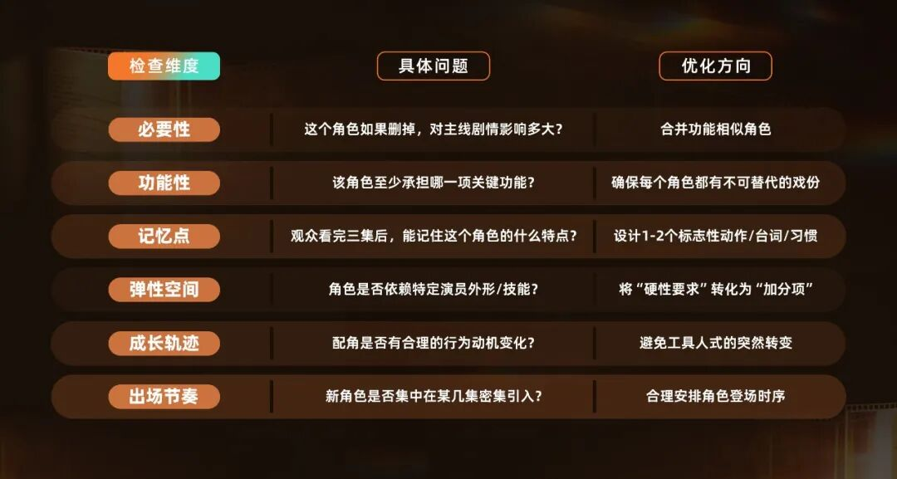
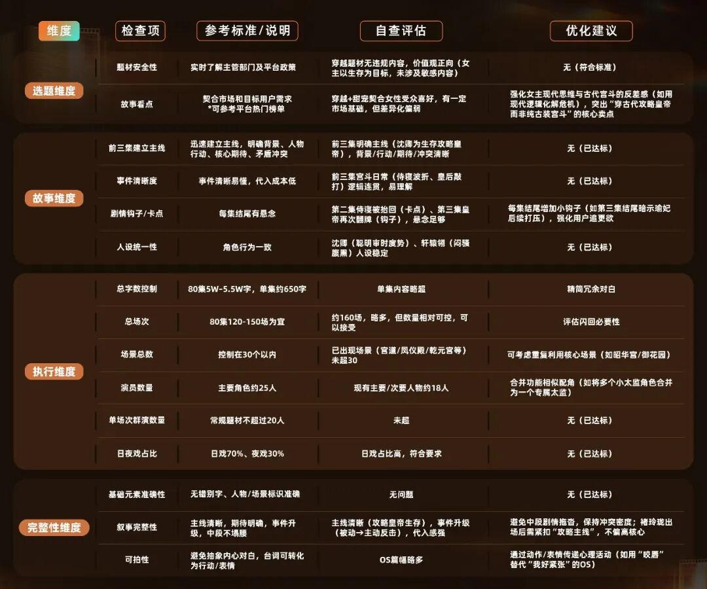

# 短剧编剧第一课｜ 08期：如何让你的剧本“更好过稿”并顺利落地？

- 公众号：红果短剧创作服务平台
- 发布时间：2026-01-22 11:45:00
- 原文链接：https://mp.weixin.qq.com/s/IEFNcUBgQW-qLFlGK8cdmQ

## 导语

2025年，微短剧市场持续升温，《中国微短剧行业发展白皮书（2025）》显示：全年独立制作的竖屏剧数量预计约4万部。在产能快速扩张的背后，内容生产的筛选机制正变得更加精细化。

从灵感到成片，中间横亘着一道道现实关卡——即便故事创意新颖、人设立体、情感饱满，如果在成本、场景、合规或执行层面存在“硬伤”，也可能在评估阶段被直接淘汰。

对许多新人编剧而言，最大的困境往往不是“不会写故事”，而是“不清楚制作方到底需要什么样的剧本”。为什么有些剧本能快速过审、顺利开机，而另一些却被反复退回甚至石沉大海？

关键或许在于剧本是否具备“可落地性”——即从合规要求、内容适配、成本考量、执行实操等方面出发，让好故事能够真正落地并顺利拍出来。

基于此，由红果短剧创作服务平台打造的「短剧编剧第一课」系列内容，特邀曾打造多部爆款短剧的平台入驻机构——「骏乐影视」，围绕“剧本落地性”议题进行深度分享。

「骏乐影视」是一家在短剧领域表现突出的创作团队，以“让好故事被更多人看见”为使命，其爆款作品贯穿了短剧行业的发展周期。从早期以“剧本+制作”的男频短剧《镇国强龙》（原名《太上无极》），到成立内容机构后纯剧本分账破百万的《祁教授结个婚》，再到古装女频崛起阶段的红果爆款《攻心为上》。骏乐影视凭借持续的内容影响力，在2025红果创作者大会上获评“年度编剧机构”。

本期，我们邀请到了骏乐影视的负责人吴文尧，他将凭借从制片管理和剧本创作的复合经验，为新人编剧系统化拆解：如何写出一个“能被选中、更能被拍出来”的剧本。

以下为访谈精华，全文约9000字，阅读预计需要20～25分钟。

“短剧是在最短的篇幅里，装下了最多的人间烟火。

编剧不能只停留在‘我想写什么’，更要前置思考‘它能否被制作方选中和拍出’。这不是限制创意，而是让创意在现实的土壤里真正扎根、生长。创作的价值在于你的故事给人们带去了欢乐和力量，借用《楚门的世界》里的一句台词：你是真的，这才是观众爱看的原因。”

———吴文尧

从创作到拍摄，剧本所经历的审核环节正变得越来越严格。这种严苛不仅体现在逐渐走高的剧本淘汰率上，更反映出市场核心逻辑的转变——用户口味的变化，正推动制作方及平台调整其选本的标准与偏好。

因此，对新人编剧而言，在投稿前能否敏锐捕捉并顺应这些变化，很大程度上决定了剧本能否在第一时间进入承制方的视野。

## 01 用户变了：口味更多元

近年来，短剧的观众群体不再局限于早期以三四线市场为主的群体，而是逐步覆盖更广泛的年龄层和兴趣圈层。随着观看经验积累，用户对内容的期待也更加多元。这意味着，单一类型或固定套路的剧本，越来越难满足所有人的喜好。制作方在选本时，会更关注剧本是否能够精准打动某一类目标受众。

## 02 制作方变了：需求更聚焦

短剧行业已逐渐走出早期快速扩张、广撒网的阶段。“市场冷静多了，”吴文尧指出，“很多团队已经通过大量项目摸索出相对清晰的内容方向，知道自己擅长什么、资源适配什么。”因此，制作方在挑本时，不再倾向于“什么都试试看”，而是会结合自身团队特点、平台近期策略以及目标受众偏好，更有针对性地选择匹配度高的剧本。

## 03 平台变了：审核更务实

与此同时，以“红果短剧创作服务平台”为代表的头部平台也在调整内容筛选机制。过去主要依赖内部编审主观判断的方式，正逐步过渡为由市场制作方参与评估。这意味着，“剧本能否落地”已成为重要的剧本入选标准。

吴文尧表示，制作方评估一个剧本时，最先看的往往不是故事有多精彩，而是有没有“不能碰”的内容。用他的话说：“再好的创意，一旦踩了红线，就直接出局，侥幸上线也难以大爆。”

这并非过度谨慎，而是行业现实，目前，平台对剧本的合规要求已不仅限于“不低俗”，更关注价值观导向、法律常识和公共影响。对此，吴文尧分享了三个新人编剧容易“踩雷”的方向：

## 01 价值观与伦理方面

例如宣扬“替身文学”、“强制爱无后果”等畸形婚恋观；主角通过违法手段达成目的却未受惩罚；或对历史人物、民族形象进行戏谑化处理等。

## 02 政策与法律层面

涉及时政、宗教、民族等敏感议题；刑侦剧中出现“私自刑讯”、“无证据定罪”等明显法律硬伤；或对真实公共事件进行虚构演绎等，都可能被平台拒收。

## 03 表现尺度问题

过度血腥暴力、带有性暗示的镜头描写，或包含对未成年人不良引导的情节（如大尺度血腥恐怖，美化校园霸凌等），也会在初审阶段被筛掉。

通过合规初筛后，剧本进入内容评估阶段。这时，制作方会重点判断：这个故事能不能打动目标用户？能不能撑起80～100集的节奏？在吴文尧看来，无论何种题材，想要剧本从内容层面真正“能打”，要着重把握几个关键标准：

剧本需在前三集立住主线：背景、主角身份、核心冲突、观众期待，要在极短时间内交代清楚。导演、演员、平台编辑可能只看前几集就决定是否继续。

主线清晰、不跑偏：整个故事应围绕一个明确的目标推进（如复仇、逆袭、追爱），避免中途插入过多支线导致看点分散。

人设有记忆点：不需要完美，但要有鲜明标签——一句口头禅、一个标志性动作、一种特殊身份（如“疯批美人”“忠犬保镖”），能让观众快速记住。

节奏干净、信息密集：短剧每分钟都要有“看点”——可以是情绪爆发、剧情反转，或关键信息推进。避免大段抒情、无效对话或拖沓铺垫。

对此，吴文尧用短剧《不装了，霍总每天都想复婚》举例。他表示团队刚拿到这个选题时，就知道市面上类似的作品已经很多了，很容易让人觉得没新意。但编剧还是下了很大功夫，按照成熟的经验打磨剧本。片子刚上线时，因为同类作品扎堆，成绩确实不太起眼。但播出一段时间后，不少观众在同类剧中更愿意看这部，觉得内容打动了他们，最终整体数据表现不错。

吴文尧总结，一个“能打”的好剧本应该是：一个卖点撑起一个故事，让观众一口气追完，并牢牢记住了一个角色。

即使内容扎实、合规过关，如果剧本在实际拍摄中“太难操作”，依然可能被搁置。吴文尧坦言：“我们经常遇到本子故事很好，但一看制作需求，就知道很难拍，这无形中就降低了剧本被选中的机会。”对此，他分享了制作方在“可执行性”方面的考量：

## 01 写剧本时，心中要有本“经济账”

“有些新人编剧对短剧的实际制作情况缺乏基本认知，导致剧本‘纸上很燃，落地很难’。”吴文尧说道。

事实上，一部标准竖屏短剧的拍摄周期通常只有 7–10天，预算多在十几万到几十万元区间，团队规模有限，日拍量却很高。这意味着：每增加一个新场景，就可能增加一天拍摄时间；每一场夜戏或外景，都意味着更高的协调成本与天气风险。

“我们经常建议编剧，在构思阶段就考虑‘能不能集中拍’。”吴文尧举例说，“比如把多个室内戏合并到同一个宅子或办公室里，通过布景微调区分功能，既节省成本，又不影响剧情推进。”

因此，动笔前，编剧必须对一部标准短剧的实际制作情况有基本认知。心中有这本“经济账”，笔下才能有分寸。

## 02 谨慎使用高难度、特殊元素

“动作戏、特效、群演……这些元素本身不是问题，但一旦大量出现，会显著拉高制作难度和不确定性。”

“比如一场需要100个群演的街头冲突戏，听起来很燃，但实际要考虑场地审批、人员调度、安全管控、天气影响等。如果这场戏不是推动主线的关键节点，通常我们会建议删减或简化。”吴文尧解释道。

同样，涉及水下、高空、飙车、爆破等高危镜头的内容，除非是故事的核心卖点，否则很容易因安全或成本原因被调整甚至放弃。

## 03 角色设计是评估剧本可拍性的关键要素

吴文尧指出，在短剧创作上，一个出色的角色设定往往比复杂的情节更能抓住观众，真正的专业编剧懂得，好的角色设计，是在创作自由与执行落地之间找到精妙平衡。

“编剧在写作时要考虑演员调度的合理性，在短剧中，观众最初的注意力往往都聚焦在人物身上。人物设计在于精，而不在于多。不要盲目地设计很多人物，避免出现重要人物戏份少、角色多但功能性重复等问题。”

他指出，人物设计的核心原则是每个角色都必须“有用且有亮点”，对此吴文尧也提供了一些可供新人编剧参考的建议：

1. 拒绝“人海战术”，追求精准叙事

观众注意力有限：短剧单集仅1-3分钟，观众的注意力最初都聚焦在人物身上。

角色数量≠故事厚度：相反，每个设计的人物都应该有明确的功能性与记忆点。

警惕常见陷阱：

❎人物重要但戏份稀少（角色浪费）

❎角色众多但功能重复（叙事冗余）

❎配角设定精彩却无后续（线索断裂）

创作自查：建议编剧在完成人物设计后，试着为剧本中每个有名字的角色写一句话描述——“这个角色为什么必须存在？”如果答案模糊，请重新审视其必要性。

2. 保持叙事连贯，降低观众理解成本

“短剧观众没有‘回看’习惯，看不懂往往意味着直接弃剧。”吴文尧坦言。

当一个场景同时出现太多新角色，或频繁切换视角时，观众往往难以建立清晰的人物图谱，观看节奏被打断，后续角色再出场时也容易让观众产生困惑。

吴文尧以80集的主流短剧为例：“在角色总量上，建议核心人物3-5人，其余角色不超过20人；在新角色引入上，建议高潮集可引入不超过2个新角色，而日常集则尽量不引入新角色；在角色功能上，建议每个配角至少承担‘推动情节’、‘衬托主角’、‘提供关键信息’中的一项功能。”

角色设定自查表（来源为骏乐影视，仅供新人编剧参考）∇

3.时刻牢记创作限制：戴着“镣铐”反而可能会跳出更美的舞

限制催生创意：有时正是“不能随便加角色”的限制，倒逼编剧们写出更精妙的人物关系。

弹性不是妥协：而是为导演、演员、制片人留出共创空间。

观众视角检验：写完每集后，想象自己是第一次看的观众——能分清谁是谁吗？能理解他们为什么这样做吗？

完成了故事构思、内容打磨与执行推演，在提交剧本前，吴文尧建议新人编剧进行一次冷静的“自我审视”：“这就像是战士出征前的最后检阅，能帮你发现那些隐蔽却致命的问题。”

吴文尧根据过往经验指出，成熟编剧通常遵循 “先看「内容」-再看「落地性」-最后看「完整度」” 的路径进行自查：

第一步：检视故事内核。抛开所有细节，用一句话说清故事核心，判断其是否足够独特、有吸引力且符合市场需求。同时放下作者视角，以读者角度，检验自己能否迅速被吸引、理解故事卖点。

第二步：落地性优化。这是最关键的步骤，需拿着“放大镜”逐一检查场景、预算、审核等风险点，确保剧本符合短剧市场的制作标准。

第三步：完整度检查。快速通读全剧，检查主线是否清晰、节奏张弛有度、人物设定统一，确保故事“顺下来”没有逻辑硬伤，同时要避免大量抽象、内心化的对白，确保每句台词都能转化为演员的行动或表情。

此外，吴文尧整理了一份剧本落地性自查清单，并以骏乐影视作品《攻心为上》为例，供编剧朋友们参考∇

同时，吴文尧也特别建议新人编剧，除了完成上述自查外，在正式交稿前进行“第三方剧本评估”。以骏乐影视为例，他们会根据机构成员的个性化需求提供周期性的创作服务，服务内容涵盖剧本评估与修改、剧本拍摄接洽及其他创作相关的扶持，凭借丰富的短剧行业经验能够为编剧提供系统化的剧本修改与创作指导。

吴文尧也表示，骏乐影视非常重视优秀的创作者，希望能让创作者真的回归创作，实现作品价值，非常欢迎优秀的短剧编剧们能加入骏乐影视的短剧剧本创作机构，开放地提供各种个性化的合作方式。

## 01 缺乏“镜头化”思维

表达抽象难以拍摄

短剧是视觉艺术，它依赖画面、动作和节奏讲故事，需要减少内心独白或抽象抒情。

吴文尧强调：少写“心理”，多写“行为”。他举例说：“有些新人常这样写人物悲伤：‘他心碎了一地，仿佛整个世界都崩塌了，陷入无尽的绝望。’，这种表述导演和演员看了会很抓狂，因为不知道怎么拍、怎么演。”

为了让新人编剧更直观地感受“镜头化”表达，吴文尧老师以工作室新人剧本为例，为新人编剧做了改写示范。

骏乐影视剧本示例，

仅供新人参考：

优化前（文学化、难拍摄）：

场景：咖啡厅 - 夜 - 内

林薇独坐于咖啡厅的幽僻角落，面前那杯咖啡早已凉透，丝丝冷意似她此刻的心绪。她静静地凝望着窗外，夜色如墨，而她的眼神，宛如被浓雾遮蔽的星辰，空洞而迷茫。

林薇（OS，语调哀伤而悠远）：

悠悠三载，恍若黄粱一梦。往昔那些如诗的甜蜜誓言，那温暖的拥抱，宛如冬日里燃烧的炉火，还有他说“永远”时，眼眸中闪烁的熠熠光芒，仿佛是夜空中最璀璨的星辰，曾照亮整个世界。可如今，这一切回忆，却如同锋利的钝刃，在她的心头缓缓划过，每一道痕迹都刻满了痛苦与绝望。她曾以为，爱情是那能将她从黑暗深渊拯救而出的绳索，却未曾料到，这不过是将她拖入更深泥沼的枷锁。

此时，陈宇迈着略显沉重的步伐走进咖啡厅，他的目光在店内扫视一圈后，落在了林薇身上。他缓缓走到她对面，轻轻坐下。一时间，寂静如浓稠的墨汁，在两人之间蔓延开来。

陈宇： 抱歉。

林薇： 抱歉什么？

陈宇： 所有。

林薇（嘴角勾起一抹苦涩的笑，似凋零的花朵）： “所有”二字，何其轻巧，又怎能承载起这三年岁月的重量？你可知道我此刻的心境？我仿佛置身于悬崖之畔，后退一步，是深不见底的万丈深渊，黑暗与绝望将我吞噬；前进一步，亦是粉身碎骨的结局，万劫不复。

陈宇： 我明白，我现在的言语都是徒劳。

林薇： 你不明白。在那些辗转反侧、难以成眠的漫漫长夜，我如困兽般在回忆的牢笼中徘徊，一遍又一遍地细数过往的点点滴滴，妄图从那些细微的痕迹中寻得你心意转变的蛛丝马迹。每一个等待你消息的时刻，我的心都如那惊弓之鸟，先是因期待而剧烈跳动，而后又在漫长的等待中逐渐冷却，直至如死灰般寂静。而当我在医院的惨白灯光下，颤抖着双手接过那张检验单时，我的世界瞬间崩塌，仿佛天与地都在那一刻失去了颜色，只剩下无尽的绝望与悲凉……

（陈宇猛地抬起头，眼中满是震惊与不解）

陈宇（声音急促）： 医院？什么检验单？

林薇（泪水夺眶而出，如断了线的珠子）：现在问，已经太迟了。

你有发现上面这段剧本的问题吗？没错——它存在缺乏镜头语言、内心独白冗长、信息密度过低、节奏拖沓、缺乏剧情张力等问题。下面是针对性优化后的版本：

骏乐影视剧本示例，

仅供新人参考：

优化后（镜头化、可执行）：

场景：咖啡厅 - 夜 - 内

（林薇坐在角落，面前放着一杯凉了的咖啡。她望着窗外，眼神空洞）

林薇（OS，述说感）：

三年了，整整三年。那些甜蜜的誓言，温暖的拥抱，还有他说“永远”时眼里的光，现在回想起来，都像一把把钝刀子，缓慢而残忍地切割着我的心。我以为爱情是救赎，没想到是更深的深渊。

（陈宇走进来，在她对面坐下。两人沉默了很久）

陈宇（声音低沉，满含愧疚）： 对不起。

林薇（高冷，带点嘲讽）： 对不起什么？

陈宇（低头再抬头看着林薇）： 所有。

林薇（苦笑）： “所有”这两个字真轻啊，轻到承载不起这三年的重量。你知道我现在是什么感觉吗？就像站在悬崖边，后退是万丈深渊，前进是粉身碎骨。

陈宇（再次低头）： 我知道说什么都没用了。

林薇： 你知道每个失眠的夜里，我是怎样一遍遍回忆那些细节，试图找出你变心的蛛丝马迹，直到当我在医院看到检验单时，那种天崩地裂的感觉……

（陈宇震惊地抬头）

陈宇： 医院？什么检验单？

林薇（流下眼泪）： 现在问，已经晚了。

相信各位可以看出，改写后，台词变得更简洁自然，情绪通过可表演的外在行为（如苦笑、流泪、沉默）传递，并且在结尾巧妙抛出悬念，激发了观众追看的欲望。

## 02 陷入“上帝视角”创作

忽视观众的理解门槛

吴文尧认为，剧本是“拍摄的蓝图”，不是“文学作品”。

许多新人编剧在审视自己的剧本时，容易陷入一种“全知全能”的思维模式——认为“观众肯定能看懂”、“导演一看就明白”。这是典型的“上帝视角”：编剧熟知每个人物的前史、每个事件的因果，但观众接收到的，只有屏幕上按顺序播放的剧情。

这种视角的错位，常导致剧本中关键信息缺失、逻辑跳跃或情感转变生硬。比如，一位编剧写：“女主突然对男主冷淡。”问他为什么？他会说：“我在人物小传里交代过，她发现男主和前任还有联系。”但剧本正文里既没交代“前任存在”，也没展现“发现过程”。最终呈现的效果，只能是人物行为突兀、情节逻辑断裂。

吴文尧特别提醒：“编剧需要‘从正文第一行开始’，就站在观众的认知起点去推进故事。关键信息应通过情节、对白或行为传递，而不能依赖任何剧本之外的‘脑补’。”

## 03 忽视“落地性”考量

脱离制作现实

许多新人编剧怀揣一个美好却危险的信念：“只要故事足够精彩，制作方总会想办法拍出来。”吴文尧对此直言不讳：“这种想法在当前的短剧市场，基本上是一厢情愿。”

他解释道，如今的市场早已告别了为“天才创意”盲目烧钱的狂热期。制片方在评估一个剧本时，首要考虑的往往不是“这个故事有多好”，而是“这个故事我们能不能又好又快地拍出来”。一个在纸面上惊心动魄、但需要调动特殊拍摄设备、依赖顶级演员或涉及复杂特效的故事，在制片人眼中，其风险远大于一个情节扎实、场景可控、选角灵活的“良好”剧本。

“能被拍出来的故事，才有资格成为爆款故事。”吴文尧强调，“剧本的‘落地性’不是创作的枷锁，而是让好故事从纸上走进观众心里的桥梁。创作之初若只仰望星空而忘了脚下预算的‘地面’，再璀璨的创意也可能在立项阶段就‘坠毁’。”

吴文尧举例，曾有一个以“水下考古”为背景的悬疑短剧剧本，故事结构精巧，悬念迭起。但其中多达1/3的关键情节发生在深海或沉船内部，需要大量的水下摄影棚和特技演员。尽管多位编审都认可其创意，但最终都因制作成本与风险完全不可控而选择放弃。这就是只考虑了故事的‘上限’——它能有多酷，而忽略了制作的‘底线’——它最少需要多少钱和时间才能拍出来。

吴文尧总结道：“新人必须明白，短剧是‘戴着镣铐跳舞’的艺术。真正的专业能力，体现在你如何在有限的预算、周期和审查框架内，最大化地实现故事的魅力。在构思第一个场景时，就要同步思考：这个场景的拍摄成本是多少？这个设定有没有更‘轻’的替代方案？”

他建议，新人编剧在动笔前，应主动了解短剧行业的基础制作常识：一个常规剧组的单日拍摄量、常见场景的租赁成本、特效镜头的价格区间等。“这不是让你变成制片人，而是让你成为一个懂得合作、理解现实的创作者。只有当你的创作蓝图与制作方的施工能力相匹配时，你的好故事，才能真正迎来在屏幕上发光的机会。”

对此，他总结道：“一个优秀的短剧编剧在创作每一集时，都要思考‘导演怎么拍？演员怎么演？观众怎么看懂？’，用最贴近生活的情节传达正向的价值，才更能在竞争激烈的短剧市场中脱颖而出。”

## 结语

从灵光乍现的创意到真正开机的剧本，这一过程完成的是从“作者思维”向“制片思维”的转变。一个好编剧，不仅得是讲故事的人，也得是故事的“第一制片人”。这意味着编剧们在构思时就要多问自己：这个角色设定好找演员吗？这个场景能实际拍出来吗？这句台词演员好表现、观众能听懂吗？

吴文尧总结道：“在短剧的世界里，一个能顺利拍出来的80分剧本，价值远大于一个无法落地的100分梦想。落地性，是好故事的第一生命力。”

最后，愿各位创作者在创作时，既能守护住最初那份“我觉得好”的灵光，也能一步步赢得制作方那句“这个能拍”的认可。祝每一个好故事，都不止于纸上，终能抵达片场。

## 下期预告

> Next in Series

下一期，我们将对话“燕北工作室”，聚焦剧本创作的关键细节——如何打磨自然、有张力且贴合角色的台词。敬请期待！

「短剧编剧第一课」系列课程计划10期访谈，将依次从新人入行指南、题材/IP选择、黄金开场、剧本主线结构、节奏与卡点设置、悬念设置、情绪爆点设计、台词打磨、网文作者转型和剧本落地性等10个方向展开科普与讲述。

更多课程内容

已收录于「短剧编剧第一课」合集

∇点击查看所有内容∇

「短剧编剧第一课」合集

更多课程内容，已收录于「短剧编剧第一课」合集

欢迎关注↓
