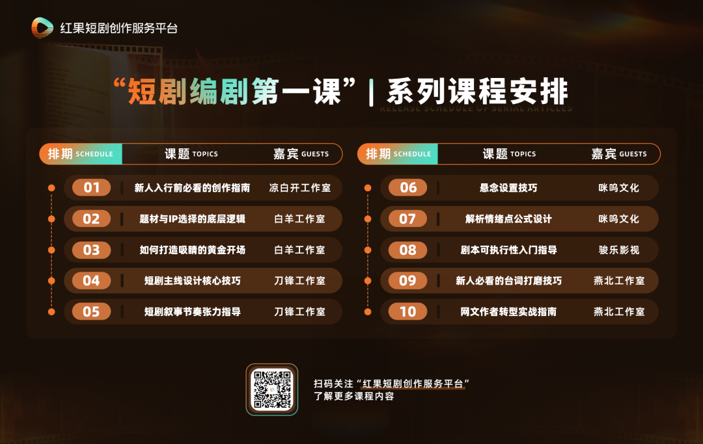

# 短剧编剧第一课｜10期：网文作者转型实战指南

- 公众号：红果短剧创作服务平台
- 发布时间：2026-02-04 11:45:00
- 原文链接：https://mp.weixin.qq.com/s/kix71hZwgt5Ua0qc06y8Ww

## 导语

在短剧行业迅猛发展的浪潮中，一群曾深耕网络文学的创作者正悄然成为内容供给的中坚力量。他们凭借对“情绪点”的敏锐嗅觉与构建故事世界的娴熟技艺，纷纷跨界涌入这个快节奏的新战场。

然而，从动辄百万字的长篇叙事，转向以秒计算的短剧创作，绝非简单的形式转换。这是一场涉及创作逻辑、节奏把控乃至协作方式的深层变革。在这片新土壤中，他们如何重新定义自己的创作价值，又需跨越哪些认知与技能的鸿沟？

红果短剧创作服务平台推出的「短剧编剧第一课」系列内容，本期聚焦“网文作者转型”这一核心议题，特邀曾打造多部分账破千万爆款短剧、红果短剧创作服务平台入驻剧本工作室——燕北工作室的负责人燕北，为新人编剧分享网文作者转型的心路历程与实战方法。

燕北工作室，由资深网文作者燕北与年代剧早期爆款编剧门小门于2025年联合创立，专注高品质短剧剧本开发。工作室深耕男频IP改编，擅长年代、都市生活、脑洞及男频情感等题材，已成功打造《重生：带着妻儿走向致富路》《东北年代之我的大腰子》《回到1983》《义薄云天之从头再来》等多部作品。本节课中，燕北将分享自身从网文作者转战短剧创作的经验方法。

以下为访谈精华，全文约5500字，阅读预计需要15～20分钟。

“小说和短剧剧本本质上并无鸿沟——核心都是讲好一个故事。所谓的‘转型’，更像是基于同一个故事内核的多元表达。关键在于，多写、多练、多拆解。”

——燕北

燕北的短剧之路，始于2024年一次朋友间的帮忙。当时，一位创业的朋友邀请他帮忙写几篇“稿子”，他抱着试试看的心态参与进去。用他的话说，是“阴差阳错地，就进去了”。彼时，他已是拥有十余年网文创作经验的成熟作者，代表作《天神殿》等拥有大量读者。

虽然入了门，但起初他对短剧的剧本结构和市场节奏完全是陌生的。他独立完成的第一部短剧剧本《都市神王夫妇》是一部男频原创作品。由于尚未掌握短剧独特的体量和节奏，他依然沿用写小说的思维，最终这个剧本写出了惊人的15万字，拍摄成了167集的“长篇短剧”。

然而，这部倾注心血的“长篇处女作”，市场反馈却未达预期。该剧在红果平台上的收藏量在20万左右，属于“中下”水平。燕北后来复盘，认为原因主要有两方面：一是当时（2024年初）短剧的免费市场模式刚起步，环境与后来不同；但更关键的是剧本本身的问题——节奏偏慢，篇幅过长，没有摆脱小说创作的叙事习惯。

尽管首战受挫，但这次实践让他真切感受到了短剧的独特魅力与潜力。他认为，“短剧能够用一个最短的篇幅去呈现一个故事，速度更快”。相较于其他创作，短剧从剧本到拍摄上线的周期更短，叙事和反馈的效率都大为提升。

在经历了几部作品的摸索与积累后，他与合伙人门小门看到了其中的机遇，并于2025年初正式成立了燕北工作室，开始更专业化、规模化地投身于短剧内容创作。

回顾这段经历，燕北觉得并没有什么巨大的冲击感。“因为我们做内容已经做了十几年了，”他说，“短剧对我们来说，它跟小说最大的区别在形式上，比如呈现结构。但它的内核是一样的——都要有好故事、好内容。”

在许多人看来，“网文作者转型短剧编剧”意味着一次职业赛道的彻底切换。但在燕北看来，这个说法本身可能就有些偏差。

“我感觉‘转型’这个词用得不太准确。”燕北在访谈中强调，“现在很多作者都是一边写小说一边写短剧，这种现象非常普遍。”他指出，当前短剧市场上，大量作品都基于番茄小说等平台上的网文IP进行改编，这本身就说明了两者血脉相连。因此，网文作者参与短剧创作，更像是一种基于同一“故事内核”的多元表达与能力延伸，而非彻底的转行。

## 01 现状与动因：为何网文作者纷纷入局？

在燕北工作室的编剧团队中，拥有网文背景的作者比例约占一半。这些作者来源多样，既有自带作品和经验的成熟作者，也有充满好奇的“纯新手”。他们加入短剧创作的原因也各不相同。

有人是看到短剧市场的快速发展和增长潜力，希望在这个新兴领域开拓新的空间。对于不少中小体量的网文作者而言，短剧剧本带来的收益可能更为直接和可观，这构成了现实吸引力；也有人是出于对内容形态创新的兴趣，想要尝试新的创作形式，拓宽自己的创作边界。“有的人是好奇，想尝试一下的比较多。”燕北补充道。

## 02 优势与挑战：熟悉的核，陌生的壳

对于有意尝试短剧的网文作者来说，优势与挑战就像一枚硬币的两面，紧密相连。

最大的优势，在于对故事内核的深度掌控与原创能力。“他们的优势是对内容的理解程度要比行外人更深一些，能够抓住故事的精髓。”燕北指出，目前平台80%—90%的短剧都源自网文IP改编。作为原始故事的创作者，网文作者最清楚自己作品的世界观、人物动机和关键情绪爆点。这种“从源头介入”的能力和强大的原创能力，是其他背景的编剧难以替代的天然优势。

但挑战也同样突出。网文作者面临的最大难点，在于短剧独特的剧本结构、叙事逻辑和节奏要求。

“他们最容易踩坑的就是不太熟悉剧本的一些结构形式。”燕北解释，“写着写着就‘小说化’了。”所谓“小说化”，具体表现为节奏缓慢、叙述性文字过多、内心戏冗长，以及可能忽略剧本必备的环境描写、动作提示等镜头语言。

如何将几十万甚至上百万字的小说精华，浓缩进每集1-2分钟、每秒都要有信息或冲突的短剧框架中？又如何把小说中细腻的心理描写、上帝视角的旁白，转化为可视、可演、可拍的具体动作与精炼台词？这些都是必须跨越的专业门槛。

基于工作室带新人的经验，燕北总结了网文作者初试短剧时，需要完成的三个关键转变。

## 01 从自由段落到标准格式：

掌握剧本的“语法”

这是最基础，也最不容忽视的一步。网文创作格式自由，以叙述性文字推动情节；而剧本则有严格的工业标准格式，包含场景（如：内/外、地点、时间）、人物动作、对白等要素，核心是“用镜头语言去写故事”。

“他们欠缺的反而是一些剧本从业者感觉最稀松平常的基础性的东西。”燕北表示，新人首先要学习并熟练运用标准剧本格式，确保写的每一句话都能被导演和演员理解。

## 02 从作者视角到观众视角：

追求“简单直给”

网文作者直接面向读者，可以运用大量心理描写和铺陈来引导读者进入故事。但剧本是给导演、演员看的，最终要面向最广泛的观众。

“短剧得简单直给，切忌太长的铺垫。”燕北强调，这就要求剧本的视角需要更聚焦，叙述必须更高效。核心任务是在最短时间内（通常是开场十几秒）让观众明白“这是一个关于什么的故事”以及“为什么值得看下去”。这意味着要砍掉一些旁支末节，紧扣主线，每一个情节都要服务于核心期待感的建立与维持。

## 03 从长线铺垫到即时冲突：

重塑节奏感

网文可以花费大量章节进行世界观铺设和人物关系建立，但短剧的节奏是“倍速”的。燕北指出，短剧需要快速推主线，情绪点和冲突点必须密集。

这要求台词字字珠玑，要么塑造人物性格，要么推动剧情发展，没有一句废话。大段的静态描写、复杂的内心独白，在短剧里需要转化成外化的动作、表情或高度凝练的对话。

燕北坦言，网文作者最难改变的是多年的写作习惯。“习惯不是说变就能变的，会在后续创作中不自觉地出现。”克服这一点，没有捷径，唯有通过大量的刻意练习。

在燕北工作室，他们为新人编剧，尤其是有网文背景的新人，总结了一套清晰的成长路径。

## 01 第一步：反向拆解，建立手感

对于完全的新人，工作室不会让他们马上动笔创作。而是先给他们提供标准的剧本格式范文，并布置一项核心作业：找一部平台上的爆款短剧，反复观看，然后将这部剧1:1反向拆解、还原成文字剧本。

“多看剧本、多看爆款剧，进行剧本还原，是对他们成长帮助最快、最大的。”燕北解释。这个过程能强迫新人以“编剧”而非“观众”的视角，去审视每一秒画面对应的文字描述是什么，去注意那些容易被忽略的环境细节、人物微表情和动作衔接。

“看一遍是没有用的，多拆解几遍，忽视的细节就会补上。”新人常会丢掉环境描写，对一些表情情绪的细节捕捉不到位，通过拆解，这些问题会暴露出来，再由经验丰富的编剧帮助指正，记忆会格外深刻。通常，独立完成2-3部爆款剧的完整拆解后，新人对于剧本格式和镜头语言就有了基本的“手感”。

## 02 第二步：从改编入手，找出“潜力股”

在掌握了基本格式后，工作室建议新人从“IP改编”开始练习。

“先做改编，相对来说更能让新人尽快适应。”燕北表示。这是因为改编提供了一个现成的、经过市场验证的故事内核和人物框架，新人可以更专注于“如何用短剧语言重新讲述”这个核心技能，降低了从零构建故事世界的难度。

关于如何挑选适合改编的IP？燕北表示，在读量高、评分好的热门IP自然有改编价值，但这类IP往往竞争激烈，新人很难抢到先机。“成熟的编剧效率更快，等你的剧本终于出炉的时候，人家都已经写了好几版了。”更重要的是培养对故事本身的判断力。有些小说可能数据不算顶级，但其主线清晰、情绪饱满、人设鲜明，非常适合视觉化改编。这就需要新人编剧平时多刷小说平台，在其中发现“潜力股”。

## 03 第三步：提纲先行，抓准主线

选定IP后，不能急于写分集剧本。首先要做的，是提炼出适合短剧的“故事大纲”（或称“主线”）。

“新人最大的一个问题，就是挑不出主线，或者写的主线不清晰，支线太多。”燕北指出。一本几十万字的小说，情节丰富，但改编时必须做减法，揪出那一条最核心、最富有戏剧冲突和期待感的主线。

工作室会要求新人先提交自己提炼的故事大纲、核心期待和主要人设。经验丰富的编剧则会据此进行审阅和指导，帮助新人判断：这条主线是否清晰？是否足够吸引人？节奏安排是否合理？以燕北工作室的作品为例：

《重生：带着妻儿走向致富路》：原著小说主线极为清晰，节奏快，改编非常顺利，“三天就搞完了剧本”。

《东北年代之我的大腰子》：原著主线较弱，支线庞杂。他们则创新性地将其改造成侧重“群像刻画、家长里短和东北喜剧特色”的剧本，跳出了纯粹的“快节奏爽剧”框架，也获得了成功。

大纲确定后，才会进入具体的分集剧本写作阶段。在这个过程中，新人会继续得到关于台词精简、冲突设置、卡点设计等方面的具体反馈。

从网文到短剧，不仅仅是技能的转换，更是心态的重塑。燕北特别提到，新人编剧，尤其是曾经有过成绩的网文作者，在转型初期最容易遇到的心态问题。

被拒稿是常态，理由通常很集中：故事套路化、缺乏新意、核心期待感弱、节奏不符合短剧要求等。“对于网文作者来说，其实对他们信心打击挺大的。”燕北表示，“多年的网文作者，对自己的内容能力是有一定信心的，如果被拒稿，有的新人编剧会自我怀疑，内耗比较严重。”

在这样的背景下，燕北建议新人编剧需要主动调整心态，做好以下几点：

首先，保持“空杯心态”。无论过去是否在小说或其他领域取得过成绩，进入短剧赛道都意味着重新出发。要以学习者的心态面对新规则、新节奏，把每一次拒稿视为发现问题、打磨作品、提升能力的机会，而不是对个人价值的否定。

其次，坚持并接受筛选。转型之路从来不是一帆风顺的。“被拒个两三次，有的人就不做了，直接放弃了，但也有顶住压力留下来的。”燕北指出，行业本身会通过反馈机制自然筛选出真正愿意深耕的人。因此，适度的抗压能力和持续行动的韧性，是走向专业编剧不可或缺的素质。

简言之，理解市场逻辑、放下自我执念、在反馈中迭代成长——这才是顺利转型的关键心态。

谈及短剧未来的趋势，燕北提到了“精品化”和“创新”。

“我认为未来精品化的比重将会更高。”燕北分析，“现在整个市场还是一个拼数量、拼产能的阶段，但未来，无论是从故事到拍摄，都会越来越趋近于精品化。”这意味着对故事本身的质量要求会越来越高。

“对于创作者来说，也要不断创作出更好的故事，加强故事创新。”燕北强调。目前市场上大量同质化的“老套路”作品，已经开始陷入“卷拍摄”的境地，而故事层面的微创新更能带来突破。

对于如何进行“微创新”？燕北给出了以下思路：

形式创新：比如“性转”（性别转换视角），或将一个都市故事放到年代背景中（时代背景互换）。这种在设定上的调整，往往能带来新鲜感。

题材融合：比如短剧《东北年代之我的大腰子》，在年代重生主线中，深度融合地域特色（东北方言）、家庭群像和喜剧元素，做出差异化。

人设创新：比如在《东北年代之我的大腰子》中，人设打破“非黑即白”的扁平化角色塑造，展现真实多面的家庭群像。剧中没有绝对的坏人，家人间的矛盾在沟通与理解中逐渐化解，呈现出温情细腻的成长型人物关系。

“创新不是颠覆，那样试错成本太高，微创新就很好。”燕北总结道。创新的目的是为了更好地抓住观众，而不是为了创新而创新。

## 结语

从《天神殿》到打造多部爆款短剧，燕北的创作轨迹印证了一个朴素的道理：无论媒介如何变迁，从文字到视频，从长篇到短篇，好故事始终是内容行业真正的硬通货。

形式在变，节奏在变，但对人性情感的洞察、对情绪节奏的把握，以及将好创意转化为引人入胜情节的能力，始终是创作者最核心的资产。对网文作者而言，进军短剧并非抛弃过往的积累，而是带着对故事的深刻理解，学习一门新的表达语言——让自己的故事以更快速、更直接的方式，去触动更多人。

正如燕北的经历所示，这条路或许是偶然的入门，也可能是必然的挑战。但无论如何，通过系统的方法和持续的练习，我们终能一步步走向理想的彼岸。

课程完结

Course completion

「短剧编剧第一课」10期系列课程至此全部结束。感谢所有受访嘉宾的真诚分享，也感谢每一位读者和创作者的陪伴。希望这个系列能为你带来一些切实的启发和帮助。创作之路漫漫，期待一起创作更多好故事！

「短剧编剧第一课」系列课程计划10期访谈，依次从新人入行指南、题材/IP选择、黄金开场、剧本主线结构、节奏与卡点设置、悬念设置、情绪爆点设计、台词打磨、网文作者转型和剧本落地性等10个方向展开科普与讲述。

更多课程内容

已收录于「短剧编剧第一课」合集

∇点击查看所有内容∇

「短剧编剧第一课」合集

更多课程内容，已收录于「短剧编剧第一课」合集

欢迎关注↓
